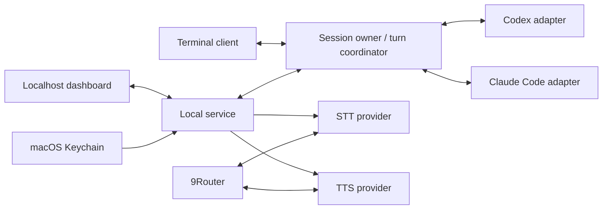

# Architecture

## Shape

Proposed stack: TypeScript, Node.js LTS, React/Vite dashboard, a local HTTP/WebSocket service, Vitest for behavior/contract tests, and Playwright for browser workflows. Confirm the supported Node version in AF-02; pin dependencies and commit the lockfile when code is introduced. A cloud Worker cannot own local terminal processes, so the backend is a local Node service.



## Session ownership and continuity

Agentflow must distinguish **discovery**, **resume**, and **live attachment**. Reading a session log is discovery, not proof that the current live process can accept messages from another controller.

- Use `(agent, nativeSessionId)` as the durable identity. Never substitute a copied chat context for a native session.
- Native agent state stays authoritative. Agentflow stores only metadata, ownership/leases, operation IDs, provider preferences, and reconnect cursors.
- Discovery prefers supported list/read APIs. Fall back to versioned read-only history adapters where necessary; guard missing, partial, corrupt, or rotated files. Avoid unbounded recursive scans on every refresh.
- For **managed sessions**, `agentflow run` creates one service-owned process/transport and connects the terminal and browser as clients. A single coordinator dispatches turns. Transport selection is the AF-01 research gate: Codex app-server is a candidate; Claude Agent SDK/streaming CLI is a candidate; a PTY wrapper is a fallback only after testing prompt boundaries and permission behavior.
- For **legacy external sessions**, first attempt a supported attach mechanism only when the installed version supports it. Otherwise show `Terminal owns this session` and explicit exit/resume instructions. Never kill the user's terminal, fork silently, or inject keystrokes into an unrelated process.
- Returning to an unmanaged terminal requires native resume after the dashboard releases ownership. An already-open native terminal may hold stale history; do not claim it has reloaded the voice turns.
- Writer lease acquisition must be atomic. Detect external ownership using supported native mechanisms where possible; uncertainty prevents write attachment and is shown to the user. Filesystem modification times alone are not proof of an idle writer.
- A browser disconnect is not permission to dispatch another turn. Reconnect restores the event cursor; duplicate operation IDs do not rerun work. Crash recovery reconciles native state and marks uncertain turns rather than replaying them automatically.

## Contracts

```ts
type AgentKind = 'codex' | 'claude';
type SessionKey = { agent: AgentKind; nativeId: string };
interface SessionSummary {
  key: SessionKey;
  title: string;
  cwd: string;
  updatedAt: string;
  state: 'available' | 'terminal-owned' | 'dashboard-owned' | 'busy' | 'unknown';
  capabilities: { resume: boolean; liveAttach: boolean; approvals: boolean };
}
interface AgentAdapter {
  listSessions(): Promise<SessionSummary[]>;
  resume(key: SessionKey, signal: AbortSignal): Promise<AgentConnection>;
}
interface AgentConnection {
  sendTurn(input: { operationId: string; text: string }): Promise<void>;
  events: AsyncIterable<AgentEvent>;
  interrupt(): Promise<void>;
  answerApproval(id: string, decision: 'allow-once' | 'deny'): Promise<void>;
  close(): Promise<void>;
}
type AgentEvent =
  | { type: 'text'; turnId: string; text: string; final: boolean }
  | { type: 'tool'; turnId: string; summary: string }
  | { type: 'approval'; id: string; summary: string }
  | { type: 'complete'; turnId: string }
  | { type: 'error'; code: string; message: string };
```

These are proposed boundaries, not implemented exports. Capability flags permit honest behavior across native CLI versions. Tool output and reasoning are not automatically spoken as assistant replies.

## Local API surface

- `GET /api/status`: service, CLI availability/version, provider configuration status; no secrets.
- `GET /api/sessions`: filtered/paginated normalized metadata; local-only.
- `POST /api/sessions/:agent/:id/attach`: acquire ownership or return an actionable conflict.
- `POST /api/sessions/:agent/:id/turns`: validated text plus operation ID; exactly one dispatch per accepted ID.
- `POST /api/sessions/:agent/:id/interrupt` and `/release`: stop an owned turn or return ownership.
- `POST /api/approvals/:id`: deliberate per-request decision. No blanket permission bypass.
- `GET/PUT /api/settings`: sanitized configuration; keys use a separate write/delete endpoint and are never read back.
- `POST /api/speech/transcribe`: bounded audio upload to the selected STT adapter.
- `POST /api/speech/synthesize`: bounded text to the selected TTS adapter, with cancelable output.
- Authenticated WebSocket: session events, ordered audio chunks, state updates, reconnect cursor.
- MCP `speak`: same speech service as the CLI/dashboard; explicit text length and output sink rules.

Names may change during AF-02; tested behavior is the contract.

## Voice state machine

`idle → listening → transcribing → thinking → speaking → listening` for hands-free mode. Push-to-talk returns to idle. Additional explicit states: `permission-required`, `interrupted`, `error`, `disconnected`.

- Ask browser microphone permission only after Start conversation.
- Capture audio with echo cancellation; local VAD identifies utterance end in hands-free mode. Silence alone is never submitted as a turn. Enforce maximum utterance duration and size.
- A finished transcription is assigned to the session and configuration generation at capture start. Switching sessions cancels or explicitly resolves an in-flight utterance.
- Keep agent text ordered. Speak completed sentence chunks with a small bounded queue; flush residual text on turn completion. Do not read raw Markdown fences or tool logs aloud.
- Barge-in stops queued audio immediately and signals interruption to the agent. Late STT, agent, or TTS results from an earlier turn cannot play or dispatch into the new one.
- Echo/re-entry behavior needs real-device tests. Start with explicit push-to-talk while establishing a reliable hands-free implementation; a push-to-talk-only prototype is not the completed voice experience.
- Provider selection is snapshotted per utterance/response. Changes take effect at the next safe turn boundary; the UI identifies when a change is pending.

## Credentials and local security

- Bind explicitly to `127.0.0.1` (and only deliberately configured loopback IPv6); default target `http://localhost:4317`.
- Validate Host, Origin, WebSocket upgrade origin, and a session-bound anti-CSRF token for mutations. Do not allow wildcard CORS. A malicious web page must not drive local agent tools.
- Store provider secrets in macOS Keychain under Agentflow service/account names. Configuration files contain secret references and nonsecret settings. Environment variables are an explicit development/headless option, never copied into the frontend bundle.
- The CLI authenticates locally using a user-only bootstrap credential/socket. Avoid tokens in query strings or logs.
- Mask and redact credential failures; no arbitrary provider response bodies in logs.
- Router URL is configurable, but credentials are attached only to the configured provider origin; do not follow cross-origin redirects with authorization headers. Keep custom endpoints explicit and validate protocols.
- Audio is transient by default. No retained recordings or extra conversation archive without opt-in. Session metadata and operational events have bounded retention.
- Preserve the agent's native approval flow. Spoken assent alone must not accidentally approve a tool request.

## Service lifecycle

A per-user launchd plist starts the packaged local service at login with absolute paths, a predictable working directory, and bounded log rotation. It must work without an interactive shell or nvm initialization. Installation, removal, and restart are idempotent. Port conflicts report clearly; no automatic process killing. Startup tolerates absent 9Router/credentials and exposes an offline state. Starting Agentflow does not itself auto-enable Docker or another paid resource.
